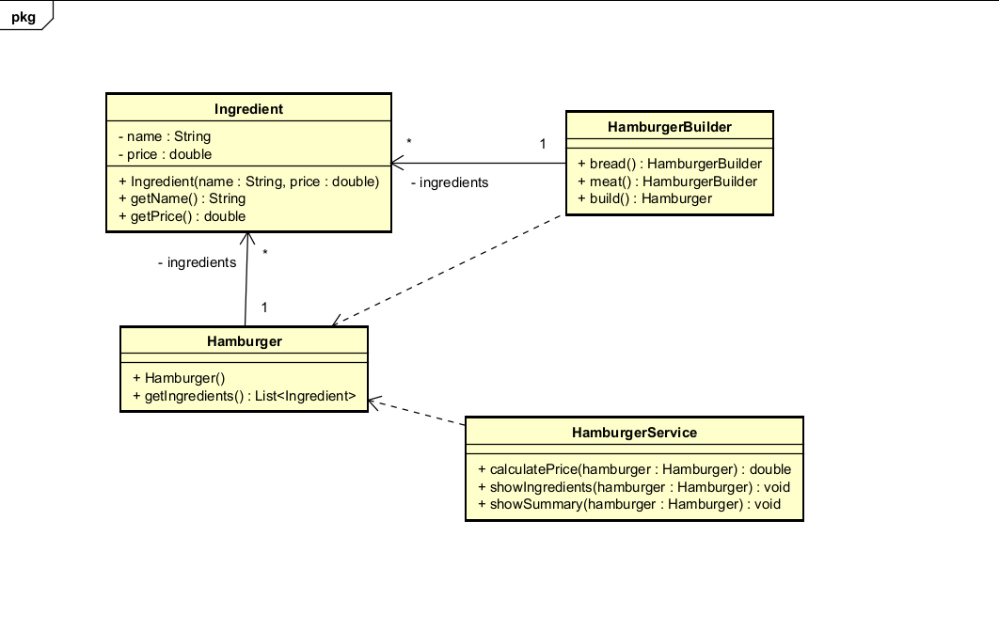
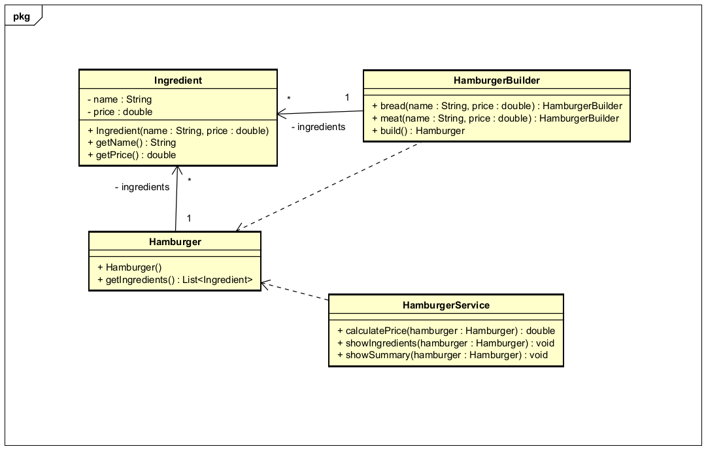
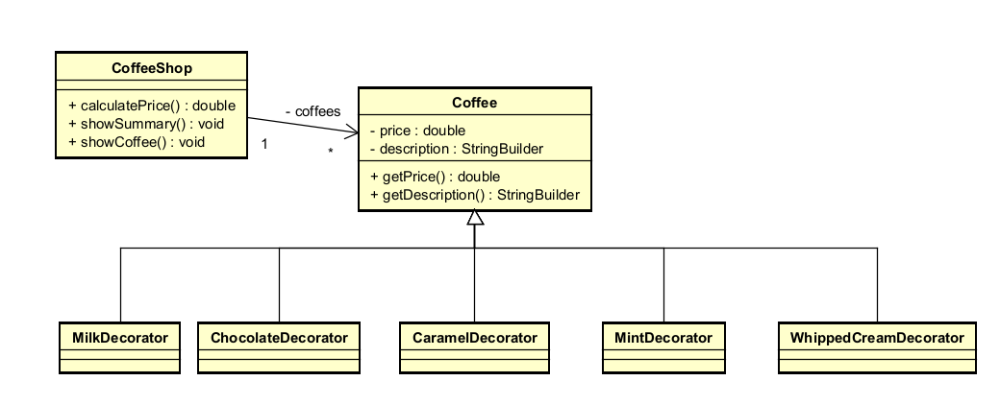
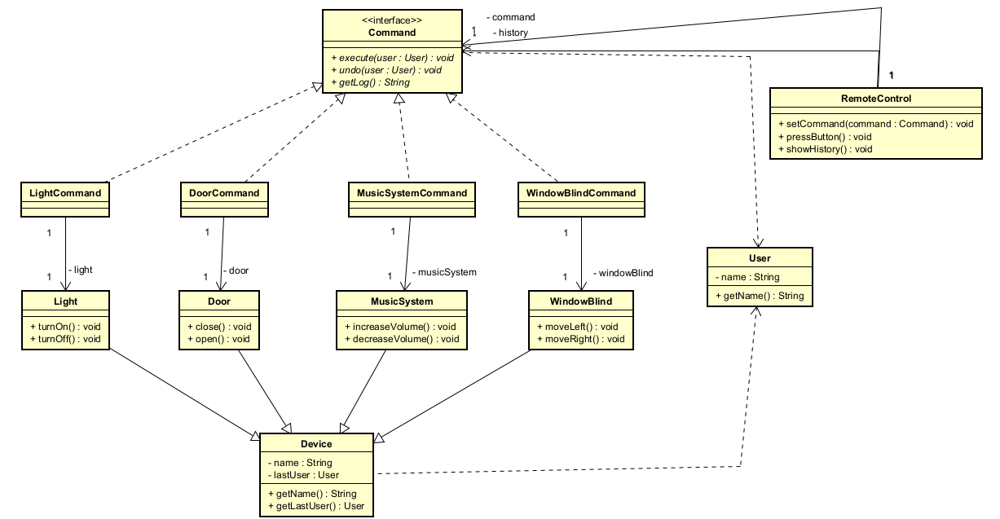

# DOSW_Lab2_Botero_Garcia_Leguizamon_Pineda
This repository is about the second laboratory of DOSW. Daniel Pinzon, Thomas Garcia
| Name | Institutional Email | GitHub User |
| --- | --- | --- |
| JOSE DANIEL GARCIA PINEDA | jose.gpineda@mail.escuelaing.edu.co | KenjiMaster |
| THOMAS SEBASTIAN GARCIA GOMEZ | thomas.garcia-g@mail.escuelaing.edu.co | thomassebastiangarciagomez-ctrl |
| MIGUEL BOTERO | | |
| JUAN GUILLERMO LEGUIZAMON RODRIGUEZ | | |

## Challenge Evidence

## Challenge 1 - Don Pepe's Store

### Diagram class

Explanation:

In the first challenge of this lab, it's essential to understand why it complies with the SOLID principles. The way these principles are fulfilled is as follows:

S (Single Responsibility): each class has only one reason to change. Product only models product data, Bill only calculates totals/discounts and builds the invoice string, NewCustomer/FrequentCustomer only know their own discount percentage, and CustomerFactory only knows how to create customers. If a frequent customer's discount rule changes, you only touch FrequentCustomer.

O (Open/Closed): thanks to the Customer interface, Bill is closed for modification but open for extension — you can add a new VipCustomer without touching a single line of Bill.getDiscountAmount(). (Note: you would have to modify CustomerFactory to support the new type, since it uses if/else instead of a Map<CustomerType, Supplier<Customer>>; this is a minor violation, common in a Simple Factory).

L (Liskov Substitution): anywhere Bill expects a Customer, you can pass either a NewCustomer or a FrequentCustomer interchangeably without breaking Bill's behavior or producing inconsistent results — both fulfill the discountCustomer() contract by returning a valid double.

I (Interface Segregation): Customer is a small, cohesive interface (two methods), so no implementation is forced to implement methods it doesn't need.

D (Dependency Inversion): Bill depends on the Customer abstraction, not directly on NewCustomer or FrequentCustomer — since the constructor receives the interface type, not the concrete type. This dependency on the abstraction is what enables the Strategy pattern.

In this way, this challenge satisfactorily fulfills the SOLID principles, showing strong, future-extensible code.

## Challenge 2 - The Five-Star Chef

### Diagram class

Explanation:

For the second challenge, the design pattern chosen was Builder. This is because HamburgerBuilder constructs a Hamburger object step by step through chained calls (bread().meat().cheese()...build()), without exposing a Hamburger constructor with a long list of parameters or forcing the object to be built in a single step. This is classic Builder: it separates the construction of a complex object from its final representation. 

This solution is key given the type of problem we're facing — a user is going to buy a hamburger, but they won't always want the same ingredients; these can vary. So it's very important to be able to create these combinations effectively, in such a way that the ingredients aren't tied to the hamburger but are instead free elements that may or may not be included in it without any consequence.

## Challenge 5 — Customized Coffee

### Diagram class

A creative coffee shop system that allows customers to customize their coffee by adding toppings, sauces, and complements. Each topping adds to the price and can be freely combined with others, while new toppings can be introduced without modifying the base coffee implementation.

### Design Pattern Documentation

| Item | Team Explanation |
|---|---|
| **Design Pattern Category** | Structural Pattern |
| **Pattern Used** | Decorator |
| **Justification** | The Decorator pattern allows new responsibilities (toppings) to be attached to a `Coffee` object dynamically, without altering its class or the classes of other toppings. This satisfies the Open/Closed Principle: the base `Coffee` stays untouched while the system grows through new decorator classes, and toppings can be stacked in any combination to build a customized coffee. |
| **How It Was Applied** | `Coffee` is the base component, exposing `getPrice()` and `getDescription()`. Each topping (`MilkDecorator`, `ChocolateDecorator`, `CaramelDecorator`, `WhippedCreamDecorator`, `MintDecorator`) extends `Coffee` and wraps another `Coffee` instance, overriding `getPrice()` and `getDescription()` to add its own cost and label on top of the wrapped object — allowing decorators to be chained to combine multiple toppings on the same coffee. `PermutadorCoffee` acts as a topping registry, mapping topping names to decorator constructors (`Map<String, Function<Coffee, Coffee>>`), so a new topping can be added by creating a new decorator class and registering it, with no changes to `Coffee` or existing decorators. `CoffeeShop` manages the collection of coffees, applies decorators dynamically through `addTopping`, and uses Java Streams (`mapToDouble().sum()` and `map().collect(Collectors.joining())`) to compute each coffee's total and the shop's overall bill. |

## Challenge 7 — The Magic Remote Control

### Diagram class

A magic remote control that executes actions on home devices such as lights, doors, music systems, and window blinds. Actions may take parameters, are tracked in a complete history, and can be undone, keeping an audit trail of which user was responsible for each change.

### Design Pattern Documentation

| Item | Team Explanation |
|---|---|
| **Design Pattern Category** | Behavioral Pattern |
| **Pattern Used** | Command |
| **Justification** | The Command pattern encapsulates each device action (turning on a light, opening a door, playing music) as an object with `execute()` and `undo()` operations. This decouples the invoker of an action (`RemoteControl`) from the object that actually performs it (`Light`, `Door`, `MusicSystem`, `WindowBlind`), and allows new commands to be added without modifying the invoker. It also naturally supports undoable operations and keeping a history of executed requests, which are core requirements of this challenge. |
| **How It Was Applied** | `Command` is the abstract class defining `execute()`, `undo()`, and `getLog()`. Each concrete command (`LightCommand`, `DoorCommand`, `MusicSystemCommand`, `WindowBlindCommand`) implements these methods by delegating the actual behavior to its associated `Device`, while storing the `User` who triggered the action and producing a log message identifying who executed or undid it. `RemoteControl` acts as the invoker: it holds the current command (`setCommand`), triggers execution or undo through `pressExecuteBotton()`/`pressUndoBotton()`, and appends every resulting log entry to a `history` list. This history provides the full audit trail needed to answer who executed each action, which actions were undone, and which user changed each device. |
