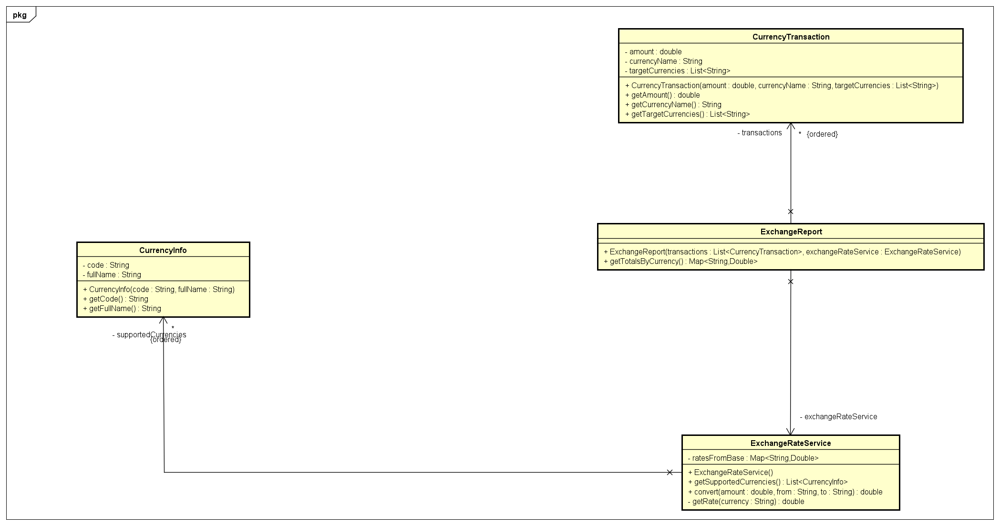
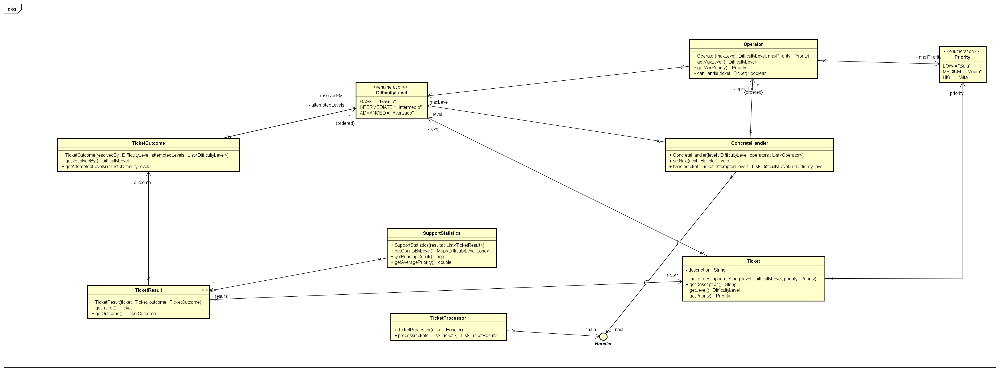

# DOSW_Lab2_Botero_Garcia_Leguizamon_Pineda
This repository is about the second laboratory of DOSW. Daniel Pinzon, Thomas Garcia

## Challenge 1 — Don Pepe's Store

### Design

- **`Product`**: represents a catalog product (name, unit price). Immutable — `final` fields, no setters — since the requirements explicitly state that the unit price must not change once the product is created.
- **`Customer`** (interface): defines the contract `discountCustomer()` (discount rate) and `getTypeName()` (customer type name, used in the receipt).
- **`NewCustomer`** / **`FrequentCustomer`**: concrete implementations of `Customer`, each with its own discount rate (5% / 10%) and its own display name.
- **`CustomerType`** (enum): `NEW`, `FREQUENT` — restricts valid customer types at compile time, preventing free-text errors (typos, inconsistent casing).
- **`CustomerFactory`**: creates the correct `Customer` based on the received `CustomerType`. Private constructor, static method — it is a stateless utility class.
- **`Bill`**: receives the product list and the `Customer`, and calculates `getSubtotal()`, `getDiscountAmount()` and `getTotal()` using Streams. `getProducts()` returns a defensive copy of the internal list, so the class's mutable state is never exposed directly.
- **`ReceiptPrinter`**: separated from `Bill`, solely responsible for formatting and printing the receipt (per-product detail, subtotal, discount, total). Private constructor, static method.

### Pattern Used

- **Category:** Creational
- **Pattern:** Factory Method
- **Justification:** the customer type (new/frequent) determines which discount rate and behavior applies. Instead of having the billing code decide directly which `Customer` subclass to instantiate (`new NewCustomer()` / `new FrequentCustomer()`), that decision is delegated to `CustomerFactory`, which interprets the `CustomerType` and returns the correct object through the common `Customer` interface.
- **How it's applied:** `CustomerFactory.createCustomer(CustomerType type)` centralizes the creation logic. Client code never references the concrete classes `NewCustomer`/`FrequentCustomer` — it only interacts with the `Customer` interface polymorphically (`customer.discountCustomer()`).

### SOLID Principles

- **S (Single Responsibility):** `Bill` only calculates; `ReceiptPrinter` only prints; `CustomerFactory` only creates customers. Each class has a single reason to change.
- **O (Open/Closed):** adding a third customer type (e.g. `VipCustomer`) only requires a new class implementing `Customer`, a new value in the `CustomerType` enum, and one additional case in the factory — without modifying `Bill`, `ReceiptPrinter`, or any existing code that already uses `Customer`.
- **L (Liskov Substitution):** any `Customer` implementation (`NewCustomer`, `FrequentCustomer`, or future ones) can be used anywhere a `Customer` is expected, without breaking `Bill`'s behavior.
- **I (Interface Segregation):** `Customer` exposes only two methods, both required by every customer type — it doesn't force implementations of behavior that doesn't apply to them.
- **D (Dependency Inversion):** `Bill` depends on the `Customer` abstraction, not on the concrete classes `NewCustomer`/`FrequentCustomer`.

### Immutability and Encapsulation

- `Product` is fully immutable (`final` fields, no setters) — the unit price cannot change after creation, as required.
- `Bill.getProducts()` returns a defensive copy (`new ArrayList<>(products)`) instead of the direct internal reference, preventing external code from modifying `Bill`'s state without going through its methods.

### Streams Used

- `filter`: discards products with an invalid price (≤ 0) before calculating the subtotal.
- `map` / `mapToInt`: extracts each product's price to sum it.
- `reduce` (via `.sum()`): sums the filtered prices into the total subtotal.
- `groupingBy` + `joining`: groups repeated products by name and builds the quantity listing for the receipt.
- `forEach`: iterates over individual products for the receipt detail.

---

## Challenge 4 — The Currency Exchange House

### Design

- **`CurrencyTransaction`**: represents a conversion request — amount, source currency, and list of target currencies. Immutable, with defensive copies of the list in both the constructor and the getter.
- **`CurrencyInfo`**: general currency information (code, full name) — no amount, since it represents reference data rather than a specific operation.
- **`ExchangeRateService`**: stores fixed rates relative to a single base currency (USD), and exposes `convert(amount, from, to)` as the single entry point. Internally resolves the conversion in two steps (source → base → target), without the caller needing to know that detail.
- **`ExchangeReport`**: receives the list of `CurrencyTransaction` and the `ExchangeRateService`, and calculates the converted totals per target currency, summing across all transactions.
- **`ExchangeReportPrinter`**: formats and prints the full report (per-transaction detail + totals), separated from the calculation logic.

### Pattern Used

- **Category:** Structural
- **Pattern:** Facade
- **Justification:** converting between currencies requires several internal steps (looking up the source currency's rate relative to the base, looking up the target currency's rate, calculating the conversion in two stages). `ExchangeRateService` hides all of that complexity behind a single simple method, `convert(amount, from, to)`.
- **How it's applied:** rates are stored only relative to a reference currency (USD) instead of storing every possible pair combination, avoiding data duplication. Callers of `convert()` don't need to know that intermediate step exists — they simply provide the amount, source, and target, and receive the result.

### SOLID Principles

- **S (Single Responsibility):** `ExchangeRateService` only converts; `ExchangeReport` only aggregates totals; `ExchangeReportPrinter` only prints.
- **O (Open/Closed):** adding a newly supported currency only requires one new entry in `ExchangeRateService`'s rate map — no existing logic is modified.
- **D (Dependency Inversion):** `ExchangeReport` depends on `ExchangeRateService`'s public method, not on how rates are stored or calculated internally.

### Streams Used

- `flatMap`: each transaction can convert to several target currencies; `flatMap` "flattens" that list of lists into a single stream of (currency, converted amount) pairs before grouping.
- `groupingBy` + `summingDouble`: groups the converted amounts by target currency and sums them.
- `IntStream.range` + `forEach`: numbers each transaction in the report without using a mutable variable inside a lambda (Java's restriction on "effectively final" variables).
- `reduce`: combines the summary text lines for the final per-currency totals, separated by " · ".

### Design Note

USD was used as the internal reference currency because it is a common convention in currency exchange systems — any other currency could have been used with the same mathematical result.

### Known Gap

`CurrencyInfo` was designed to hold general currency reference data (code, full name) but is not currently wired into `ExchangeRateService` or any other class — it exists as a standalone data class not yet connected to the rest of the solution. A future improvement would be to have `ExchangeRateService` validate currencies against a list of `CurrencyInfo` before attempting a conversion.

### Diagram

---

## Challenge 6 — Talk to Technical Support

### Design

- **`DifficultyLevel`** / **`Priority`** (enums): `BASIC/INTERMEDIATE/ADVANCED` and `LOW/MEDIUM/HIGH`, each with a display name for output formatting. Enum declaration order defines ranking (used via `.ordinal()` to compare levels).
- **`Ticket`**: data — description, difficulty level, priority. Immutable.
- **`Operator`**: data — maximum difficulty level and maximum priority a technician can handle. `canHandle(Ticket)` checks both conditions must be satisfied for the operator to resolve the ticket.
- **`Handler`** (interface): defines `setNext(Handler)` and `handle(Ticket, List<DifficultyLevel>)`. The second parameter accumulates the levels that failed to resolve the ticket before it escalates, so the full escalation path can be reported.
- **`ConcreteHandler`**: single reusable implementation of `Handler`, configured with a difficulty level and a list of `Operator`s. If none of its operators can resolve the ticket, it records its own level as a failed attempt and delegates to the next handler in the chain (or returns `null` if it is the last link).
- **`TicketOutcome`**: which level resolved a ticket (or `null` if none did) plus the list of levels that were attempted and failed before that.
- **`TicketResult`**: pairs a `Ticket` with its `TicketOutcome`.
- **`TicketProcessor`**: runs a list of tickets through the chain (starting from the first handler) and collects a `TicketResult` for each one.
- **`SupportStatistics`**: calculates counts by resolved level, pending count, and average priority across all tickets, using Streams.
- **`PrinterTicket`**: formats and prints the per-ticket detail (including escalation history) and the final statistics summary.

### Pattern Used

- **Category:** Behavioral
- **Pattern:** Chain of Responsibility
- **Justification:** each technician (`ConcreteHandler`) independently decides whether it can resolve a ticket or must escalate it to the next technician. The client code (`TicketProcessor`) only needs to know the first handler in the chain — it has no knowledge of how many technicians exist, what order they're in, or which one ultimately resolves a given ticket.
- **How it's applied:** handlers are linked at runtime via `setNext()`, forming a chain (basic → intermediate → advanced). Each `handle()` call either resolves the ticket or delegates to `next.handle(...)`, recursively, until someone resolves it or the chain is exhausted.

### SOLID Principles

- **S (Single Responsibility):** `ConcreteHandler` only decides resolve-vs-escalate; `TicketProcessor` only runs tickets through the chain; `SupportStatistics` only aggregates; `PrinterTicket` only prints.
- **O (Open/Closed):** a single reusable `ConcreteHandler` class means adding a new support level requires no new class — only a new `DifficultyLevel` enum value, a new `ConcreteHandler` instance configured with the right operators, and one additional `setNext()` link.
- **L (Liskov Substitution):** any `Handler` implementation can be placed anywhere in the chain and be called via `handle()` without the caller needing to know its concrete type.
- **D (Dependency Inversion):** `TicketProcessor` depends on the `Handler` abstraction, not on `ConcreteHandler` directly.

### Streams Used

- `anyMatch`: checks whether at least one `Operator` in a handler's list can resolve a given ticket.
- `groupingBy` + `counting`: counts resolved tickets per difficulty level for the statistics.
- `filter` + `count`: counts pending tickets (those with a `null` resolved level).
- `mapToInt` + `average`: calculates the average priority across all tickets (priority mapped to a numeric value via `.ordinal() + 1`).
- `IntStream.range` + `forEach`: numbers each ticket in the printed report.

### Design Note

The requirements describe technicians as having both a specialty (difficulty level) and a maximum priority they can handle. `Operator.canHandle()` therefore requires both conditions to be satisfied — a ticket within a technician's difficulty range but above their priority limit will still escalate.

### Diagram

